## 👋 Hi there

    

### About me
- 🔭 I'm currently working on my latest **security tool**
- 👀 I'm looking to collaborate on innovative software projects
- 💬 Ask me about **Software Engineering & Cybersecurity**

### Programming Languages

               

### Web Development

        

### Mobile Development

     

### Back-end & Database

         

### DevOps & Tools

       

### Deep Learning & Computer Vision

      

### Game Development

     

### Blockchain / Web3

     

### Embedded Systems

     

### System Administration

       

<i>System configuration, administration and shell scripting</i>

### IDEs & Development Environments

         

### Agile Methodologies

<i>XP (Extreme Programming), Scrum, Kanban</i>

### Cybersecurity

         

<i>Threat modeling, static & behavioral analysis, security testing, ethical hacking and reverse engineering</i>